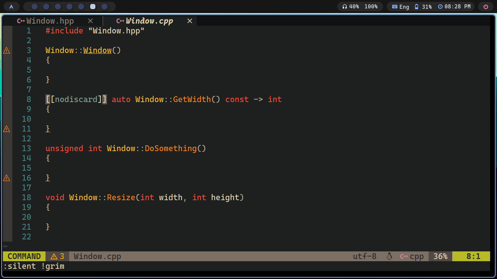

***This tool is discontinued and thus the repository archived, please see [generate.nvim](github.com/eriks47/generate.nvim) Neovim plugin
for C++ method implementation generation.***

# Generate Method Definitions

A simple regex based C++ method and function implementation
generator.



### Building

##### Requirements

cmake (version 3.20 or above)   
vcpkg   
c++23   
ninja

##### Build proccess

```shell
cmake -B build -S . -G Ninja -DCMAKE_TOOLCHAIN_FILE=/path/to/vcpkg/script
cmake --build Build
```
### Running

After the build has been performed the 
program can be ran the following
way:

```shell
./Build/main
```
